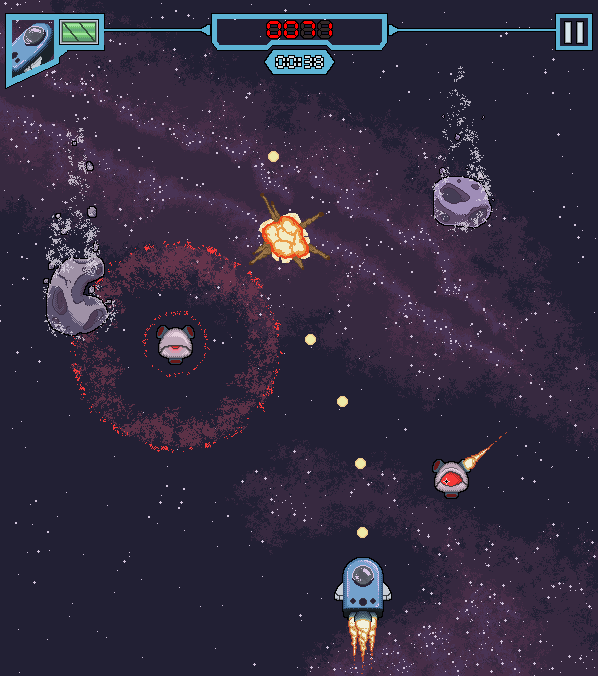

# Space Ranger Cinnamon

[Final game mockup]

## Introduction

This is a small hobby project. It's a game about a kitten called Cinnamon and its space adventure. It's a rather simple space shooter game.

The game itself will be written in rust and it'll use the Bevy game engine. The goal is to compile the game to WASM, stuff it in React and host it as a static page.

## Development

### Building

1. Install Rust with [rustup](https://rustup.rs/)
2. `cargo run`

### Keybinds

- `A` - move left
- `D` - move right
- `Q` - dash left
- `E` - dash right
- `Space` - shoot
